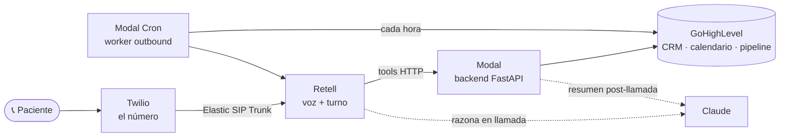

# Sofía — Agente de Voz con IA para negocios locales

> Una recepcionista con IA que **contesta el teléfono 24/7**, califica al que llama,
> **agenda la cita** en tu calendario y llena tu CRM — sola. Y cuando un cliente no llega,
> **le devuelve la llamada** para reagendar.

Sofía no es un chatbot: es **infraestructura de voz vendible**. La instalas una vez, la
replicas para cada cliente con un cambio de configuración, y cobras instalación +
mantenimiento mensual. El caso ancla es una **clínica dental**, pero el mismo sistema sirve
para inmobiliarias, despachos de abogados, gimnasios y restaurantes — los cinco nichos vienen
listos.

---

## Qué hace Sofía en una sola llamada

1. **Contesta 24/7** con voz natural en español (`retell-Andrea`, `es-419`), sin sonar a robot.
2. **Califica** — motivo, síntoma, urgencia (prioriza dolor/sangrado) y datos de contacto.
3. **Agenda** la cita directo en el calendario de GoHighLevel.
4. **Llena el CRM** — crea el contacto, abre la oportunidad en el pipeline y deja un resumen
   de la llamada con la temperatura del lead (hot / warm / cold).
5. **Devuelve llamadas (outbound)** — un worker revisa el CRM cada hora y llama a los no-shows
   y leads pendientes para reagendar.

Nunca diagnostica, nunca inventa una cita: si el calendario falla, ofrece seguimiento humano
en lugar de mentir.

---

## Arquitectura — un proveedor por capa, a propósito



| Pieza | Rol |
| --- | --- |
| **Retell** | La voz y los oídos: STT + TTS y la orquestación del turno de conversación. |
| **Twilio** | El número que suena, conectado a Retell por Elastic SIP Trunk. |
| **Claude** | El cerebro: razona en llamada (Haiku) y hace el análisis post-llamada (Opus). |
| **Modal** | El backend Python/FastAPI donde viven las tools, 24/7 con URL pública. |
| **GoHighLevel** | La fuente única de la verdad: contacto, cita y pipeline. El backend no guarda estado propio. |

---

## Instalación — un solo comando

Este proyecto se instala con tu agente (**Claude Code** recomendado). Clónalo, ábrelo en tu
agente, arrastra `INSTALAR.md` al chat y escribe:

> **instálalo**

```bash
git clone https://github.com/Carlos-Dominguez-faber/sofia-agente-voz.git
cd sofia-agente-voz
# abre la carpeta en Claude Code → arrastra INSTALAR.md al chat → escribe: instálalo
```

El agente te entrevista, valida cada credencial en vivo, crea y publica los dos agentes de
Retell, conecta tu número de Twilio, despliega el backend a Modal y el panel de control a
Vercel, y al terminar imprime la **URL de tu panel + la contraseña**. Tarda ~20-30 min.

📄 **Guía completa, prerrequisitos y troubleshooting → [`INSTALAR.md`](INSTALAR.md).**

### Cuentas que necesitas

| Cuenta | Para qué | Plan |
| --- | --- | --- |
| **Retell** | Voz (STT + TTS + turno) | Pago por minuto |
| **Twilio** | El número (vía SIP Trunk) | Pago por uso |
| **GoHighLevel** | CRM + calendario + pipeline | Según tu plan |
| **Anthropic** | El cerebro | Pago por uso |
| **Modal** | El backend | Free sirve |
| **Vercel** | El panel de control | Hobby (gratis) |

> ⚠️ **El único gate que nada acelera:** el bundle regulatorio del número de Twilio (para
> México tarda 1-3 días hábiles en aprobarse). Cómpralo y arráncalo **antes** de instalar.
> Detalles en [`INSTALAR.md`](INSTALAR.md).

---

## Los comandos

| Comando | Qué hace |
| --- | --- |
| `/setup` | Instala todo de punta a punta (entrevista → valida → crea agentes → despliega). |
| `/test` | Verifica los 5 servicios (Retell · Twilio · GHL · Backend · Anthropic) con la solución de cada error. |
| `/customize` | Adapta el agente a otro nicho, voz o negocio **sin romper el pacing ni los guardrails** — y publica el cambio en vivo. |
| `/status` | Estado de todos los servicios y la última llamada. |

---

## Los 5 nichos incluidos

La carpeta [`prompts/`](prompts/) trae cinco negocios listos, con estructura idéntica —
solo cambian las preguntas de calificación, el vocabulario, el tono y la acción que cierra:

`dental` (el ancla) · `inmobiliaria` · `abogados` · `gimnasio` · `restaurante`

Replicar a otro cliente del mismo nicho es aplicar un snapshot de GHL + correr `/customize`.

---

## El panel de control

Un panel en Next.js (en [`dashboard/`](dashboard/)) desde el que el cliente **opera todo sin
tocar Retell, Modal ni GHL**: ve métricas, escucha llamadas con transcripción, y **edita voz,
comportamiento y prompt de Sofía publicándolo en vivo al número real**. No tiene base de datos
propia — lo lee todo de GHL y del backend. Es lo que sostiene el mantenimiento mensual.

Documentación del panel en [`dashboard/docs/`](dashboard/docs/): `BLUEPRINT.md`,
`USER-STORIES.md`, `PROMPT-DASHBOARD.md`, `README.md`.

---

## Estructura del proyecto

```
sofia-agente-voz/
├── INSTALAR.md              # el flujo "instálalo" (léelo primero)
├── BRIEF.md · BRIEF-TECNICO.md · CLAUDE.md · planeacion.md
├── sofia.config.yaml        # datos del negocio (se versiona; sin secretos)
├── .env.example             # las credenciales que hacen falta (vacío)
├── prompts/                 # los 5 nichos
├── app/                     # backend en Modal (main.py) + worker outbound (worker.py)
│   └── services/            # ghl · retell · twilio · anthropic · dashboard
├── scripts/                 # setup · test · customize · status (deterministas)
├── dashboard/               # el panel de control (Next.js)
└── tests/
```

---

## Documentación

| Documento | Para qué |
| --- | --- |
| [`INSTALAR.md`](INSTALAR.md) | Instalar paso a paso, prerrequisitos, troubleshooting. |
| [`BRIEF.md`](BRIEF.md) | Qué es y qué hace, en lenguaje de negocio. |
| [`BRIEF-TECNICO.md`](BRIEF-TECNICO.md) | El detalle técnico de cada capa. |
| [`CLAUDE.md`](CLAUDE.md) | El mapa del proyecto para tu agente. |
| [`dashboard/docs/`](dashboard/docs/) | Cómo se construye y opera el panel de control. |

---

<sub>Proyecto educativo de **Imperio Digital**. Las credenciales viven en `.env` (nunca se
versiona) y el sistema no guarda estado propio fuera de tu GoHighLevel.</sub>
